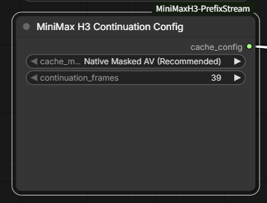
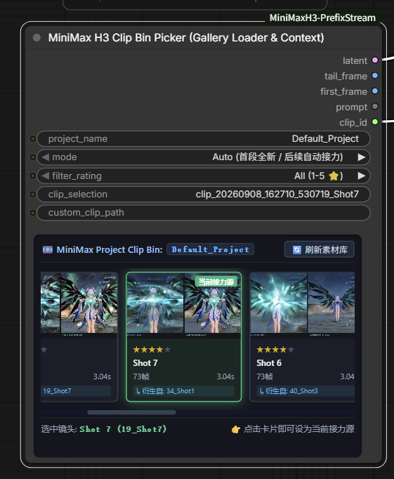

# ComfyUI-MiniMaxH3-PrefixStream

[](LICENSE)
[]()
[]()

[English](README_EN.md) | 简体中文

面向 **MiniMax H3 长视频生成** 的 ComfyUI 节点套件。它把一段段短片组织成可管理、可选择、可无缝承接的长视频流程：生成片段、归档到素材箱、可视化挑选要承接的镜头，再继续生成下一段。

它以低侵入方式接入现有的原生 MiniMax H3 工作流：保留你的模型、提示词、采样器与解码链路，只在续写处插入配置与应用节点。默认的 **Native Masked AV** 路径参考了 [Herrgott's H3 Infinite Continuation Suite](https://github.com/HerrgottMargott/Herrgotts-H3-Infinite-Continuation-Suite)，使用 ComfyUI 原生去噪遮罩保护上一段的音视频上下文；`Safe Native` 则是兼容性备选方案。

---

## 核心特性

- 🎬 **为长视频续写而生**：每一段既是成片，也是下一段可复用的上下文；自动处理重叠开头裁切与音画同步，让分段生成可以稳定累积为长视频。
- 🧩 **低侵入地兼容原生 H3 工作流**：不改动 ComfyUI 源码，也不 monkey-patch H3 DiT block。沿用原有模型、提示词、采样和解码节点，只增加续写所需的少量节点。
- 🛡️ **默认使用 Native Masked AV**：将上一段干净的视频/音频 latent 直接写入下一段开头，并用 ComfyUI 原生遮罩保护；视频、音频各自独立控制。`Safe Native` 保留为兼容性备选。
- 🗂️ **可视化接力素材箱**：自动归档片段预览、评分、镜头标签、提示词及前后镜头血缘；在画廊中按画面和评分选择任意历史片段，直接接力，而不是靠文件名猜测。
- 🎯 **准确且可控的上下文**：使用 H3 兼容的 `39 / 90 / 141 / 192 / ...` 帧网格。默认 39 帧约为 1.625 秒，并精确对应 65 个音频 latent tick。
- 🔒 **减少续写冲突**：移除受保护开头内的关键帧，避免第 0 帧引导与复制的 latent 上下文相互冲突；后续端点和参考条件仍可正常使用。

---

## 快速浏览

```text
原生 MiniMax H3 工作流 → 生成当前片段 → Clip Bin 自动归档
                                      │
                                      ▼
                     在画廊中选择任意历史镜头作为接力来源
                                      │
                                      ▼
                  Continuation Config / Applier → 原生 H3 继续采样
                                      │
                                      ▼
                        裁切重叠开头 → 拼接为长视频 → 再次归档
```

### 一个节点选择续写方案

`MiniMax H3 Continuation Config` 只保留必要的核心选择：普通续写使用 **Native Masked AV (Recommended)**；只有工作流需要兼容方案时才切换为 **Safe Native**。`continuation_frames` 用于选择 H3 帧网格上的受保护重叠长度。



### 从素材箱浏览并继续镜头

`MiniMax H3 Clip Bin Picker` 将已保存的片段以可视化画廊呈现。选择上一镜头、按评分筛选，并将其 latent 与尾帧作为下一段的续写上下文，无需在输出目录中翻找文件。



---

## 工作原理

```text
上一段完整音视频 latent ──► 选择规范的 39/90/141/... 帧尾部
                                      │
目标空音视频 latent ───────────────────┼──► 将尾部复制到目标开头
                                      └──► noise_mask =（视频遮罩，音频遮罩）
                                                        │
                                                        ▼
                                      ComfyUI 原生 MiniMax H3 采样
```

---

## 自定义节点

| 节点名称 | 分类 | 说明 |
| :--- | :--- | :--- |
| **`MiniMax H3 Continuation Config`** | `MiniMaxH3/PrefixStream` | 选择默认的 `Native Masked AV` 或备选的 `Safe Native`，并设置用户可见的视频上下文长度。 |
| **`MiniMax H3 Continuation Applier`** | `MiniMaxH3/PrefixStream` | 构建原生视频/音频遮罩并输出 `masked_latent`；在备选模式下应用避免冲突的关键帧条件。 |
| **`MiniMax Trim Prefix`** | `MiniMaxH3/PrefixStream` | 在像素和音频波形空间裁切开头的重叠帧，避免 VAE 因果闪烁并保持同步。 |
| **`MiniMax Long Video Stitcher`** | `MiniMaxH3/PrefixStream` | 在像素和音频波形空间无缝拼接长视频与新片段，具备自适应亮度匹配与重叠区线性交叉淡入淡出（消除爆音）。 |
| **`MiniMax Save AV Latent`** | `MiniMaxH3/PrefixStream` | 独立地将联合音视频 latent 保存为 safetensors，无外部依赖。 |
| **`MiniMax Load AV Latent`** | `MiniMaxH3/PrefixStream` | 独立加载带有元数据的联合音视频 latent，用于多片段连续流式生成。 |
| **`MiniMax H3 Clip Bin Saver`** | `MiniMaxH3/PrefixStream` | 连同预览图、评分、镜头标签、提示词和续写血缘归档生成片段。 |
| **`MiniMax H3 Clip Bin Picker`** | `MiniMaxH3/PrefixStream` | 以画廊方式查找已保存的片段，并输出其 latent、尾帧、提示词和 ID。 |
| **`MiniMax Cache Telemetry Monitor`**| `MiniMaxH3/PrefixStream` | 显示当前续写模式、受保护上下文几何信息和会话进度。 |

---

## 安装

将仓库克隆到 ComfyUI 的 `custom_nodes` 目录：

```bash
cd ComfyUI/custom_nodes
git clone https://github.com/knoic/ComfyUI-MiniMaxH3-PrefixStream.git
cd ComfyUI-MiniMaxH3-PrefixStream
pip install -r requirements.txt
```

重启 ComfyUI 后，节点会出现在 `MiniMaxH3/PrefixStream` 分类下。

---

## 运行单元测试

可通过以下命令进行本地验证：

```bash
python -m unittest discover -s tests -v
node tests/test_clip_bin_frontend.cjs
```

---

## 低内存长视频输出

新增 `MiniMax H3 Disk Video Stream`：逐片段写入磁盘，最后合成 MP4，无需在内存中累计全部画面。需要 FFmpeg，采用硬切拼接；原拼接节点继续提供亮度匹配和接缝淡化。连接与导出步骤见[中文指南](docs/USER_GUIDE_CN.md#磁盘分段长视频低内存)。

## 示例工作流与文档

- 📄 **可直接使用的工作流**：[`examples/MiniMaxH3_PrefixStream_v1.0.json`](examples/MiniMaxH3_PrefixStream_v1.0.json)
  - 将这份完整的 42 节点 JSON 直接拖入 ComfyUI 画布，即可运行 PrefixStream 长视频生成。
- 📖 **中文详细使用指南**：[`docs/USER_GUIDE_CN.md`](docs/USER_GUIDE_CN.md)
  - 包含硬件建议、参数调节、多片段无限续写流程与常见问题。

---

## 致谢与参考项目

本项目的诞生与时空续写设计深受以下开源项目与作者的启发，特此致以诚挚的感谢与敬意：

1. **[ComfyUI-H3-Motion-Context](https://github.com/NikoDemon80/ComfyUI-H3-Motion-Context)** by **[@NikoDemon80](https://github.com/NikoDemon80)**
   - 感谢 NikoDemon80 在 MiniMax H3 关键帧锚定算法、VAE 时空周期相位网格对齐公式（Snap to Run Grid）、音视频头部裁切及 5/3 音视频时间缩放比例方面的先驱性数学探索与启发。

2. **[Herrgotts-H3-Infinite-Continuation-Suite](https://github.com/HerrgottMargott/Herrgotts-H3-Infinite-Continuation-Suite)** by **[@HerrgottMargott](https://github.com/HerrgottMargott)**
   - 感谢 Native Masked AV 的原生分流遮罩、精确 AV 上下文边界及独立音频保护方案。

---

## 许可证

本项目采用 [MIT 许可证](LICENSE) 发布。
